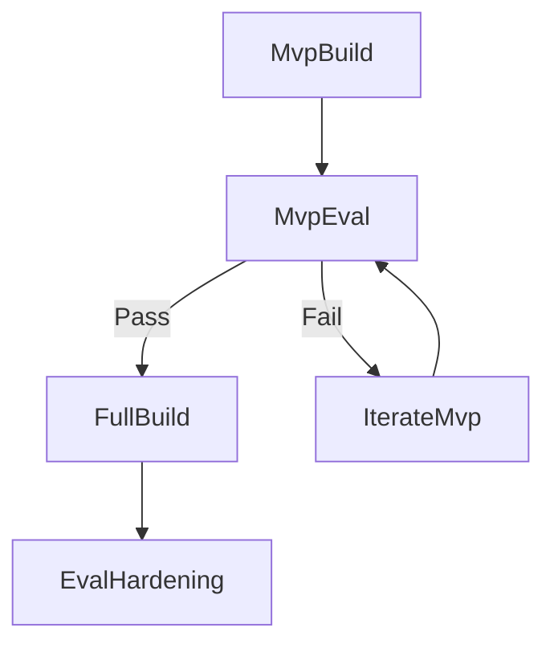

# FAM MVP-First Implementation Plan

## Goal

De-risk the project quickly by first proving the core functionality is complete and correct for Phase 1 on mock infrastructure. Because no real GPU inference backend is attached in MVP, performance numbers are treated as exploratory only. If functional validation passes, expand to full spec coverage.

## Phase 1: MVP (Proof of Idea)

### MVP Scope (build only what is required to test the hypothesis)

- **Core control loop**
  - [D:/data/fam/fam/telemetry/collector.py](D:/data/fam/fam/telemetry/collector.py)
  - [D:/data/fam/fam/pricing/engine.py](D:/data/fam/fam/pricing/engine.py)
  - [D:/data/fam/fam/budget/manager.py](D:/data/fam/fam/budget/manager.py)
- **Decision and execution path**
  - [D:/data/fam/fam/confirmation/handler.py](D:/data/fam/fam/confirmation/handler.py)
  - [D:/data/fam/fam/dispatch/queue.py](D:/data/fam/fam/dispatch/queue.py)
- **Minimal integration path**
  - [D:/data/fam/fam/adapters/langgraph/adapter.py](D:/data/fam/fam/adapters/langgraph/adapter.py)
  - [D:/data/fam/fam/interfaces/gpu_mock.py](D:/data/fam/fam/interfaces/gpu_mock.py)
  - [D:/data/fam/fam/interfaces/tool_mock.py](D:/data/fam/fam/interfaces/tool_mock.py)
- **Minimal observability for decisions**
  - [D:/data/fam/fam/metrics/collector.py](D:/data/fam/fam/metrics/collector.py)

### Out of MVP Scope (defer intentionally)

- Speculative continuation rollback depth from [D:/data/fam/specs/spec-08-speculative-continuation.md](D:/data/fam/specs/spec-08-speculative-continuation.md)
- Capability probe and tiered signal system from [D:/data/fam/specs/spec-05-tiered-signal-formatter.md](D:/data/fam/specs/spec-05-tiered-signal-formatter.md) and [D:/data/fam/specs/spec-15-capability-probe.md](D:/data/fam/specs/spec-15-capability-probe.md)
- Full config hot-reload surface from [D:/data/fam/specs/spec-12-configuration-and-tuning.md](D:/data/fam/specs/spec-12-configuration-and-tuning.md)
- Full evaluation harness and shadow-price convergence pipeline from [D:/data/fam/specs/spec-14-evaluation-harness.md](D:/data/fam/specs/spec-14-evaluation-harness.md)

### MVP Acceptance Criteria (go/no-go gate)

- **Functional completeness**
  - telemetry -> pricing -> budget -> confirmation -> dispatch -> adapter flow executes end-to-end
  - both tool-call outcomes are exercised: `completed` and `cancelled`/`deferred`
  - per-agent registration and budget lifecycle APIs work (`check`, `deduct`, `replenish`)
- **Correctness and safety**
  - no negative balances and no double-spend under concurrent calls
  - price update objects always include reasoning price and per-endpoint tool prices
  - dispatch queue never deadlocks; submitted calls either resolve or fail with explicit error
- **Behavioral sanity checks (mock-only)**
  - high congestion increases tool price relative to low congestion
  - confirmation policy changes behavior across low vs high price regimes
  - metrics collector records core counters/gauges for pricing and dispatch paths
- **Performance note**
  - throughput/latency comparisons against baseline are non-blocking diagnostics in Phase 1
  - hard performance gates move to Phase 3 with real backend integration/evaluation harness

### MVP Validation Experiments

- Use a compact validator in:
  - [D:/data/fam/examples/](D:/data/fam/examples/)
  - [D:/data/fam/tests/test_eval/](D:/data/fam/tests/test_eval/)
- Required Phase 1 checks:
  - `functional_flow_check` (single and concurrent agents)
  - `budget_correctness_check` (deduct/replenish/insufficient budget)
  - `confirmation_behavior_check` (low vs high price regimes)
  - `dispatch_reliability_check` (worker progress, retry path, explicit failures)
- Optional diagnostic checks:
  - `baseline_uncoordinated` vs `fam_mvp_dynamic_pricing`
  - agent counts `1, 8, 32` for trend visibility only

## Phase 2: Full Productization (after MVP pass)

### Expand Feature Surface

- **Communication richness + parser robustness**
  - [D:/data/fam/fam/signals/protocol.py](D:/data/fam/fam/signals/protocol.py)
  - [D:/data/fam/fam/signals/formatter.py](D:/data/fam/fam/signals/formatter.py)
  - [D:/data/fam/fam/signals/templates.py](D:/data/fam/fam/signals/templates.py)
- **Speculative continuation**
  - [D:/data/fam/fam/speculative/manager.py](D:/data/fam/fam/speculative/manager.py)
- **Infrastructure adapters**
  - [D:/data/fam/fam/interfaces/gpu_cluster.py](D:/data/fam/fam/interfaces/gpu_cluster.py)
  - [D:/data/fam/fam/interfaces/tool_endpoint.py](D:/data/fam/fam/interfaces/tool_endpoint.py)
  - [D:/data/fam/fam/adapters/base.py](D:/data/fam/fam/adapters/base.py)
- **Configuration and observability completeness**
  - [D:/data/fam/fam/config/schema.py](D:/data/fam/fam/config/schema.py)
  - [D:/data/fam/fam/config/defaults.yaml](D:/data/fam/fam/config/defaults.yaml)
  - [D:/data/fam/fam/metrics/prometheus.py](D:/data/fam/fam/metrics/prometheus.py)
  - [D:/data/fam/fam/metrics/events.py](D:/data/fam/fam/metrics/events.py)

### Phase 2 Exit Criteria

- Full orchestrator flow supports confirmation, deferral, and result reinjection paths.
- Prometheus + structured logs expose pricing, budgets, queue depths, and decision outcomes.
- Config surface covers all implemented modules with validated defaults.

## Phase 3: Research-Grade Evaluation and Hardening

### Evaluation and Tiering

- Implement full evaluation package:
  - [D:/data/fam/fam/eval/harness.py](D:/data/fam/fam/eval/harness.py)
  - [D:/data/fam/fam/eval/tasks.py](D:/data/fam/fam/eval/tasks.py)
  - [D:/data/fam/fam/eval/baselines.py](D:/data/fam/fam/eval/baselines.py)
  - [D:/data/fam/fam/eval/shadow_solver.py](D:/data/fam/fam/eval/shadow_solver.py)
- Implement capability probe:
  - [D:/data/fam/fam/eval/probe.py](D:/data/fam/fam/eval/probe.py)
  - [D:/data/fam/fam/eval/probe_scoring.py](D:/data/fam/fam/eval/probe_scoring.py)

### Hardening

- Add regression gates in CI for:
  - budget accounting correctness
  - queue fairness and timeout rates
  - benchmark drift against frozen baselines
- Expand property-based testing for parser, controller stability, and queue invariants.

## Implementation Sequence Diagram

## Key Risk Controls

- Keep MVP narrow to prevent overbuilding before validation.
- Use mocks first to isolate orchestration behavior from external infra variance.
- Lock shared contracts before full build to avoid API drift across modules.
- Treat speculative continuation as post-MVP due to rollback complexity.

## Definition of Done

- **MVP done:** Phase 1 functional scope is complete and correctness/safety checks pass on mock backends.
- **Full implementation done:** major specs implemented with production-grade observability/configuration.
- **Research done:** five experiment classes reproducible with stable comparison outputs.

