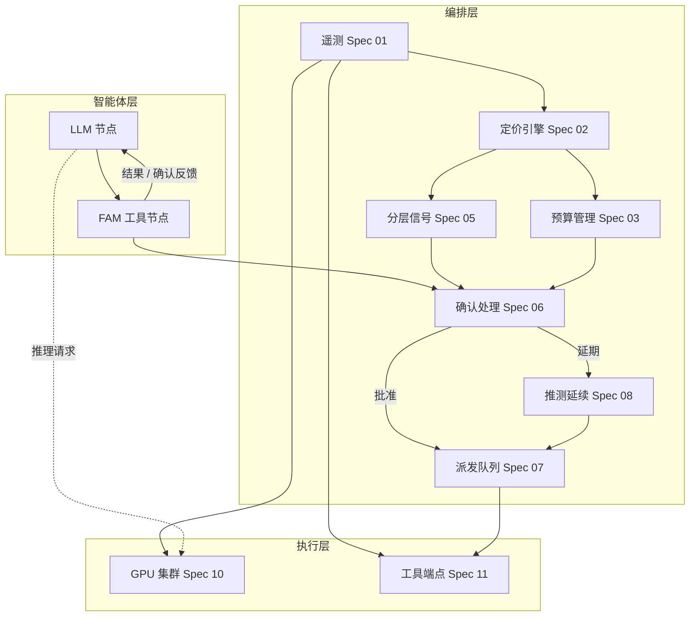

# FAM（Free Agent Market）学术概览

本文档依据仓库内 `specs/` 目录下的体系规格（含 `spec-00-arch.md` 至 `spec-15-capability-probe.md` 及 `meta-spec.md`）整理，面向学术读者，系统阐述 **FAM** 的研究动机、理论内涵、方法学设计与预期学术影响。文中术语与模块编号与规格一致。

---

## 摘要

**FAM（Free Agent Market，自由智能体市场）** 是一套基于 **LangGraph** 的多智能体编排层：在 **GPU 推理集群** 与 **外部工具端点** 等共享资源有限的前提下，通过 **动态价格信号** 与 **每智能体预算**，使多个大语言模型（LLM）智能体在 **不依赖中央调度器** 的情况下，根据实时稀缺程度 **自主调节** 推理强度与工具调用，从而缓解资源争用、级联延迟与饥饿现象。规格将 FAM 明确定位为 **“围绕智能体执行进行拦截与包装，而非 fork 或侵入式修改框架”** 的协调机制，并配套 **遥测—定价—预算—确认—派发—推测延续** 的完整数据流，以及面向论文级复现的 **五类实验、基线、消融与影子价格对照** 设计。

---

## 1. 研究背景与问题陈述

### 1.1 多智能体共享基础设施的典型失效模式

当多个 LLM 智能体共享 **有限的 GPU 推理容量** 与 **有限速率/容量的工具 API** 时，若访问 **无协调**，易出现：争用导致的 **延迟尖峰**、无效重试、以及低优先级任务 **饥饿**。传统 **硬速率限制** 将请求 **同质化** 处理，既不区分紧迫性与价值，也不向智能体提供 **可行动的稀缺信息**，难以支撑 **自适应** 行为。

### 1.2 FAM 的核心命题（规格层面的表述）

FAM 将共享资源组织为 **资源市场**：每种共享资源具有随 **实时稀缺度** 波动的 **价格**；每个智能体具有 **预算** 约束；智能体在承诺高成本操作（尤其工具调用）前接收 **定价信号**，并可在 **继续执行、推迟或放弃** 之间选择。规格强调：系统在负载升高时 **提价**，智能体 **自我节流**，争用下降；负载降低时 **降价**，智能体可更积极利用廉价资源。由此实现 **去中心化协调**：全局效率通过 **局部价格响应** 涌现，而非依赖不透明、一刀切的限流。

---

## 2. 设计原则及其学术含义

规格中的设计原则可直接对应到系统论文中常见的 **设计 rationale** 条目：

| 原则 | 学术解读 |
|------|----------|
| **价格信号优于硬限制** | 将 **准入控制** 从二元拒绝转为 **连续标量信号**，保留智能体 **自主性**，同时引导负载。与机制设计中的 **价格发现** 思想一致。 |
| **拦截而非修改** | **关注点分离**：任务定义、提示与工具实现留在用户侧；编排层仅 **中介** 工具时机与资源计量，便于 **形式化边界**（FAM 拥有什么、委托什么、明确不做什么）。 |
| **预算作为背压** | **每智能体预算 + 补充速率** 构成 **最终节流阀**，缓解 **公地悲剧**（共享池下激进智能体挤占保守者）。 |
| **按能力分层降级** | 承认 **异质模型** 对数值经济的处理能力不同；将 **信号复杂度** 与 **模型能力** 匹配，属于 **人—模型协同** 与 **鲁棒人机接口** 议题。 |
| **可观测性非可选** | 支撑 **生产调试** 与 **实验复现**：定价、预算变更、确认与派发均需带上下文记录。 |
| **配置优于改代码** | 曲线、阈值、时间常数等 **超参** 外置，利于 **系统实验** 与 **敏感性分析**。 |

---

## 3. 系统架构（三层）

### 3.1 三层划分与职责边界

规格将系统划分为 **智能体层、编排层、执行层**：

- **智能体层**：用户定义的 LangGraph `StateGraph`；FAM **不拥有** 图结构本身，通过适配器（Spec 09）在 **工具调用边界** 插入 **FAM 工具节点**，并扩展状态（如 `agent_id`、当前价格、分层定价信号、`pending_tool_calls`、`speculative_mode`、FAM 注入消息历史等）。智能体层 **拥有** 任务定义、提示、工具选择与推理链；**不拥有** 工具实际执行时机、定价、确认流与预算策略裁决。
- **编排层**：在智能体与共享资源之间 **中介** 每一次与资源相关的决策。主干数据链为 **遥测采集（Spec 01）→ 定价引擎（Spec 02）**；**预算管理（Spec 03）** 维护全局余额与扣减/补充；面向智能体的 **通信协议（Spec 04）** 与 **分层信号格式化（Spec 05）** 将内部状态转为可注入消息；**确认处理（Spec 06）** 在工具调用点做准入与交互；**工具派发队列（Spec 07）** 执行限流与优先级派发；**推测性延续（Spec 08）** 处理 **延期（defer）** 后的暂态推理与回滚。
- **执行层**：GPU 推理集群（Spec 10）与工具端点（Spec 11），仅通过 **抽象接口** 暴露遥测与调用能力；FAM **不调度集群内部** 推理队列，只影响 **是否、何时** 代表智能体提交调用。开发与评测可用 **mock** 生成可控负载与延迟分布。

**横切能力** 包括：配置与调参（Spec 12）、指标与可观测性（Spec 13）、评测框架（Spec 14）、能力探针（Spec 15）。其中 **能力探针** 通常在 **注册/首次使用** 时运行，结果为 **信号分档**，供 Spec 05/06 使用，与周期性遥测循环正交。

### 3.2 核心机制

以下机制共同构成 FAM 的 **“市场 + 预算 + 交互式承诺”** 闭环：

1. **价格更新（PriceUpdate）闭环**  
   编排器按固定 **遥测间隔** 轮询执行层（或通过推送）获取 GPU 与各工具端点指标；遥测经平滑（如 EMA）后输入 **双通道定价**（推理价、各端点工具价）。每个定价节拍产出不可变的 **`PriceUpdate`**（含 `reasoning_price`、`tool_price`、利用率快照与时间戳），作为 **预算扣减口径**、**确认阈值判断**、**注入智能体的信号内容** 的 **统一真源**。

2. **预算作为最终背压**  
   每智能体独立余额；**补充** 按预算 tick 累积（可设上限）；**扣减** 在 **批准的工具调用** 等事件上 **原子** 执行（不足则整笔失败）。预算管理器 **只记账、不单独决定策略**；是否拦截、是否进入确认、是否进入推测，由 **确认处理** 等与规格一致的策略模块组合决定。

3. **定价确认（priced confirmation）**  
   当工具价低于 **自动批准阈值** 时，路径 **短路**：直接扣预算并入队派发，减少交互延迟。当价格或策略要求确认时，**分层信号格式化** 按该智能体 **能力档** 生成确认文案（成本、剩余预算、估计等待时间、替代建议等），经 **通信协议** 注入对话；解析智能体回应为 **批准 / 延期 / 取消**（规格亦允许超时默认策略）。

4. **派发、拥塞与延期**  
   **工具派发队列** 按端点维护优先级队列，遵守速率限制与重试策略；当队列深度超过阈值时，可对 **新** 调用 **延期** 并通过协议通知智能体进入 **推测性延续** 或等待，从而将 **端点拥塞** 反馈为 **可观察行为变化**。

5. **推测性延续与一致性**  
   延期后智能体可在 **工具结果待定** 下继续生成 token；此类 token 按 **当前推理价** 计费。真实工具结果返回后，**推测性延续管理** 做 **一致性** 判定：可保留推测内容或 **回滚检查点** 并注入真实结果，保证对话状态与工具语义一致。

### 3.3 智能体工作流程（典型推理—工具循环）

从 **单个智能体、单次工具调用** 视角，规格定义的执行序可概括为（与 `spec-00-arch` 中工具拦截流一致）：

1. **普通推理**：用户在图中的 LLM 节点产生 **含工具调用的输出**。
2. **进入 FAM 工具节点**（适配器插入）：解析待执行工具与目标端点；读取 **当前 `tool_price`** 与该智能体 **预算余额**（及必要时由预算管理器校验）。
3. **预算不足**：若不满足扣减条件，**不派发**；向对话注入 **预算不足** 类消息，回到 LLM 节点由智能体调整计划。
4. **低价自动批准**：若工具价低于配置的 **自动批准阈值**，**跳过确认**；按当前价 **扣减预算**，将请求提交 **派发队列**，异步等待端点结果后 **注入工具结果**，再回到 LLM。
5. **需确认**：否则由 **信号格式化** 生成该档确认请求，**中断（interrupt）** 图执行或等价机制，等待智能体显式决策：
   - **批准**：同第 4 步扣费、入队、回注结果。
   - **取消**：注入取消说明，回到 LLM，不扣工具费、不派发。
   - **延期**：进入 **推测性延续**（检查点、待定提示、按推理价计费的推测 token）；后续在价格/队列条件允许时再 **批准派发** 或触发超时策略，最后 **协调** 推测内容与真实结果。

多智能体场景下，上述循环 **并发** 进行；**共享** 的是 **同一编排器实例** 上的 `PriceUpdate`、预算表、派发队列与遥测任务（`asyncio` 单事件循环内通过 **无 yield 的原子段** 等约定保证预算与队列一致性，见架构规格）。

### 3.4 模块间交互（控制流与数据流小结）

| 方向 | 交互内容 | 参与模块 |
|------|----------|----------|
| 执行层 → 编排层 | 原始利用率、队列深度、延迟、速率限制余量等 | Spec 10/11 → Spec 01 |
| 编排层内部（周期） | 标准化遥测快照 → PI/比例定价 → **`PriceUpdate`** | Spec 01 → Spec 02 →（广播至）Spec 03、05、06、08 |
| 编排层 → 智能体 | 定价信号、确认请求、延期/取消通知、工具结果、`[FAM]` 前缀系统消息等 | Spec 04 + Spec 05，经 Spec 09 注入状态 |
| 智能体 → 编排层 | 工具调用意图、对确认的文本/结构化回应 | Spec 09 → Spec 06 |
| 编排层 → 执行层 | 经队列 **节流后** 的实际 HTTP/RPC 工具调用 | Spec 07 → Spec 11 |
| 横切 | 注册时 **能力探针** 写入分档；全程 **指标** 记录定价/预算/确认/队列/推测事件 | Spec 15 → Spec 05/06；Spec 13 |

**背景任务与智能体任务的关系**：**遥测循环** 与 **预算补充循环** 与具体智能体 **解耦**，持续刷新全局价格与余额；**智能体图** 仅在 LLM 步与 FAM 工具步时 **订阅** 当时的最新价格与预算视图。派发 **worker** 与多个 `ainvoke`/`astream` 智能体任务 **并发**，通过队列与 `Future` 等机制将工具结果 **路由回** 正确的图实例。

---

## 4. 学术贡献（分主题详述）

以下贡献点主要直接来自各规格对 **机制、形式化联系与评测合同** 的界定，便于在论文中分别声明 **概念贡献、系统贡献与实证贡献**。

### 4.1 双重资源市场：推理价格与工具价格

FAM 维护 **两类价格**（`reasoning_price` 与按端点区分的 `tool_price`），而非单一资源价格。规格给出的论证是：GPU 推理与外部工具 **稀缺动态解耦**——可能出现 **GPU 紧张而某工具空闲** 或相反。分离定价使智能体可做 **细粒度替代**：例如在 **推理相对便宜** 时延长思考，在 **工具相对便宜** 时更积极调用。**价格比** `tool_price / reasoning_price` 被明确定义为面向决策的关键标量，并由信号格式化模块转化为自然语言或分层描述。

**学术意义**：将多智能体 LLM 系统中的资源管理从 **单瓶颈模型** 推广为 **多商品、多约束** 的简化市场；为 **任务内替代弹性**（推理 vs. 工具）的实证度量提供接口（见评测实验类型 2）。

### 4.2 控制论式定价与影子价格（Lagrange 乘子）的联系

定价引擎规格（Spec 02）将 **PI（比例—积分）控制器** 作为默认实现：利用利用率与目标设定点之间的 **误差** 驱动价格，并含 **积分抗饱和** 与 **上下界钳制**。文档明确指出：在 **智能体为理性预算约束优化者** 等假设下，引擎产生的在线价格可视为 **集中式资源分配问题** 中 **影子价格（shadow prices）** 的 **近似**。

**学术意义**：

- 在 **优化与控制的交叉** 上，为 “**去中心化智能体 + 在线反馈定价**” 提供可写的 **理论锚点**（即使完整证明可在论文中单独展开）。
- 评测规格（Spec 14 **实验类型 3**）要求：在线记录 FAM 价格轨迹后，用 **离线求解器** 在给定效用与容量下计算 **理论最优影子价格**，并报告 **相对误差、收敛时间、与最优社会福利的差距** 等。这使 “**近似影子价格**” 不仅是修辞，而是 **可检验假说**。

### 4.3 预算机制：公平、背压与动态收入

每智能体预算支持 **原子扣减、补充速率、历史查询**；规格将 **策略**（预算耗尽时如何处理）与 **记账** 分离。架构文档论证：**共享池** 易引发公地悲剧，而 **每智能体预算 + 稳定补充** 在允许 “为昂贵操作储蓄” 与 “廉价期快速消费” 的同时，限制 **单智能体垄断**。

**学术意义**：将 **公平性** 与 **稳定性** 纳入同一 **显式状态变量**（余额），便于与 **资源分配论文** 中的 **份额、令牌桶** 等基线对照（评测中的 **硬速率限制基线** 即体现不同公平—效率折中）。

### 4.4 定价确认（Priced Confirmation）与信息经济学视角

确认处理模块（Spec 06）在 **工具价格超过拥塞阈值** 等条件下拦截工具调用，向智能体注入 **成本、剩余预算、估计等待时间** 等信息，并解析 **确认 / 取消 / 延期（defer）** 等决策；低价格区可 **自动批准** 以降低延迟。该设计将 **是否调用工具** 从纯模型输出转为 **带显式成本披露的承诺步骤**。

**学术意义**：连接 **不完全信息下的决策** 与 **HCI / 智能体安全** 中的 **人在回路** 变体（此处 “人” 可为同一 LLM 在下一轮对成本的显式回应）。同时为 **机制透明度**（智能体是否 “知道” 自己正在支付什么）提供工程载体。

### 4.5 分层信号与能力探针：异质认知模型

**能力探针（Spec 15）** 在注册时以 **少量固定提示**（低温）评测：**预算算术、补充推理、稀缺下优先级、相对价格反应、锚定鲁棒性** 等维度，并映射到 **定量 / 定性 / 定向** 三档信号。**分层信号格式化（Spec 05）** 将同一内部定价状态转为 **全数值、标签化语言、或单行行为提示**，避免对弱模型 **浪费上下文或引入错误算术**。

**学术意义**：

- 将 **“模型能否做经济推理”** 从隐含假设提升为 **可重复、可缓存的测量工具**，便于在论文中讨论 **能力分层下的系统表现**（对应评测 **实验类型 5**）。
- 与 **自适应接口**、**认知负荷** 文献对话：信号不是 “越细越好”，而是 **与接收者能力匹配** 时更优——规格对此给出了 **可操作的工程定义**。

### 4.6 推测性延续（Speculative Continuation）：延期与资源利用

当智能体 **延期** 工具调用时，若无配套机制，智能体可能 **阻塞**，仍占用 KV 与队列 slot。**推测性延续（Spec 08）** 允许在 “结果待定” 下 **继续推理**；推测 token **按当前推理价格计费**；结果到达后做 **一致性核对**，必要时 **检查点回滚** 并注入真实工具结果。

**学术意义**：将 **异步工具 / 推测执行** 思想引入 **多智能体 LLM 编排**，并在规格层面绑定 **预算计量与状态一致性**，为讨论 **延迟隐藏 vs. 一致性代价** 提供具体设计点；评测中可通过消融 **关闭推测模块** 量化贡献（Spec 14 消融表）。

### 4.7 评测框架：五类实验、基线与消融（研究合同）

**Spec 14** 将 “FAM 是否成立” 分解为五个可发表问题，并各对应 **实验类型**：

1. **规模扩展**：并发智能体数从 1 增至 N 时，**完成率 × 准确率** 相对单智能体基线是否 **温和退化**（非断崖）。
2. **价格响应**：外生工具价格乘子变化下，**工具调用率** 与 **推理 token** 是否呈现 **替代**；估计 **工具需求的价格弹性**；监测对 **准确率** 的影响。
3. **影子价格收敛**：FAM 在线价格与离线最优影子价格的 **轨迹误差、收敛时间、相关性**；**社会福利** 对照。
4. **消融**：关闭定价、预算、确认、信号注入、推测延续等模块，逐项归因 **哪部分带来可测增益**。
5. **能力分档对比**：强制不同信号档或混合探针分档，比较 **工具使用、确认接受率、公平性（如工具调用基尼系数）** 等。

**基线** 包括：**无协调派发**、**静态系统提示劝诫**、**硬速率限制**、**仅工具定价（无预算与确认）**，用于隔离 **“真实负载信息 + 预算—确认机制”** 的边际价值。

**学术意义**：该规格构成一篇系统论文 **实验章节** 的 **预注册式骨架**：问题、自变量、控制量、主指标与统计重复（`repetitions`、`seed_base`）均有模板，有利于 **可重复研究** 与 **与审稿人对齐评估标准**。

---

## 5. 预期影响与适用边界

### 5.1 对学术子领域的影响

- **多智能体 LLM / 工具增强推理**：提供 **显式资源经济学接口**（价格、预算、确认），使 **策略性行为**（推迟调用、加大推理）可被 **记录与激励**。
- **分布式系统与云计算**：将 **背压、准入与定价** 从基础设施内部暴露为 **智能体可理解信号**，便于与 **调度、SLO、多租户** 研究衔接（规格注明初期 **单租户信任环境**，多租户与安全为后续议题）。
- **经济学与机制设计**：**去中心化市场近似集中最优** 的实证路径通过 **影子价格实验** 具体化；**弹性与替代** 通过 **价格响应实验** 具体化。
- **人机交互与 AI 能力评估**：**能力探针** 可作为 **独立贡献**（经济推理基准的一种工程化实例），与 **分层提示** 结合讨论 **鲁棒性**。

### 5.2 规格中明确的不做之事（界定研究范围）

架构文档列出 FAM **不** 负责：集群 **内部** GPU 请求调度、修改工具实现、覆盖智能体在预算充足时的最终决策、跨进程重启的持久状态、以及认证授权与多租户。这些边界有助于学术论文 **准确陈述贡献与非目标**，避免过度声称。

### 5.3 实现与路线图提示

`PLAN.md` 与规格一致地采用 **MVP 优先**：先在 mock 上验证 **遥测→定价→预算→确认→派发→适配器** 闭环与正确性，再扩展 **分层信号、推测延续、完整评测与影子价格流水线**。因此，当前仓库以 **规格与架构** 为主时，学术文本宜区分 **已规格化设计** 与 **代码实现成熟度**。

---

## 6. 规格文献映射表

| 规格编号 | 文件名（示例） | 主题 |
|---------|----------------|------|
| 00 | `spec-00-arch.md` | 架构、数据流、边界、并发与部署 |
| 01 | `spec-01-telemetry.md` | GPU 与工具端遥测、平滑与健康检查 |
| 02 | `spec-02-pricing-engine.md` | 双 PI 定价、价格比、与影子价格联系 |
| 03 | `spec-03-budget-manager.md` | 每智能体预算生命周期 |
| 04 | `spec-04-agent-communication-protocol.md` | 消息类型与注入格式 |
| 05 | `spec-05-tiered-signal-formatter.md` | 定量/定性/定向信号与分档 |
| 06 | `spec-06-confirmation-handler.md` | 定价确认与超时策略 |
| 07 | `spec-07-tool-dispatch-queue.md` | 优先级队列、限流、延期通知 |
| 08 | `spec-08-speculative-continuation.md` | 推测会话、计费与回滚 |
| 09 | `spec-09-framework-adapters.md` | 框架适配与 LangGraph 集成 |
| 10 | `spec-10-gpu-cluster-interface.md` | GPU 集群抽象与 mock |
| 11 | `spec-11-tool-endpoint-interface.md` | 工具端点抽象与 mock |
| 12 | `spec-12-configuration-and-tuning.md` | 全参数配置与默认值 |
| 13 | `spec-13-metrics-and-observability.md` | 指标、日志与看板 |
| 14 | `spec-14-evaluation-harness.md` | 五类实验、基线、消融、影子求解 |
| 15 | `spec-15-capability-probe.md` | 经济推理能力探针与评分 |
| — | `meta-spec.md` | 各规格一句话索引与建议实现顺序 |

---

## 7. 结语

依据 `specs/` 的集体表述，**FAM 的学术内核** 可概括为：在 **多智能体共享推理与工具资源** 的场景下，用 **在线价格与预算** 实现 **可解释、可度量、可对照理论最优（影子价格）的去中心化协调**，并通过 **分层信号与能力探针** 处理 **模型异质性**，通过 **推测性延续** 处理 **延期与利用率**。配套评测规格将上述主张转化为 **可复现实验合同**，使该项目不仅是一套实现蓝图，也是一篇 **系统研究论文** 的方法学骨架。

---

*文档生成依据：`d:/data/fam/specs/` 下各规格及 `meta-spec.md`；若规格后续修订，请同步更新本节内容与表格。*
